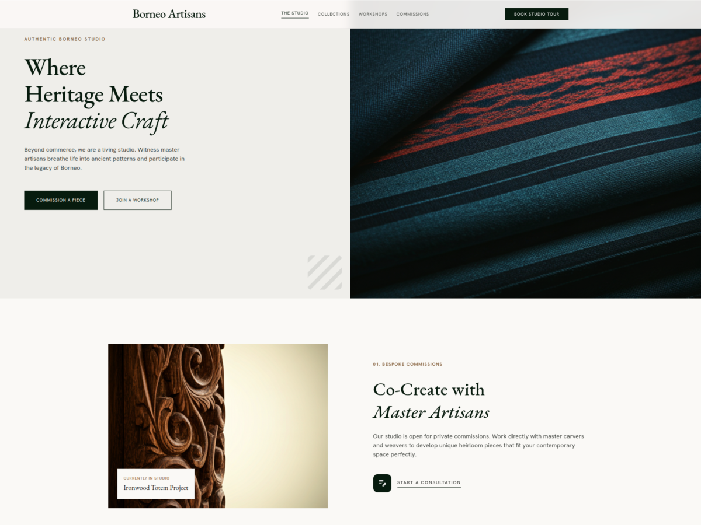

# Sukses — Modern WordPress Theme for Borneo Artisans

A hybrid WordPress theme built for the Block Editor (FSE) and Elementor. Sukses combines elegant Material Design 3 aesthetics with accessibility-first principles and fluid, responsive layouts.

## Overview

**Sukses** is a production-ready WordPress theme designed for studios, creative agencies, and content-focused websites. It bridges full-site editing (FSE) with Elementor compatibility, giving you flexibility in how you build.

### Key Features

- 🎨 **Material Design 3** — Custom color palette inspired by nature (forest greens, warm ochres)
- ♿ **Accessibility First** — WCAG 2.1 AA compliant, tested with screen readers
- 📱 **Fluid Responsive** — Typography and spacing scale smoothly across all viewports
- 🔧 **Hybrid Builder Support** — Works seamlessly with Block Editor and Elementor
- 🚀 **Performance Optimized** — Clean code, lazy-loaded assets, minimal dependencies
- 🎯 **Content-First** — Layout serves content, never the reverse
- 🎭 **Beautifully Styled** — Ready-to-use block patterns and template parts

## Requirements

- **WordPress:** 6.7 or later
- **PHP:** 7.2 or later (8.0+ recommended)
- **Fonts:** Google Fonts (EB Garamond, Hanken Grotesk, Material Symbols)
- **Browsers:** All modern browsers (Chrome, Firefox, Safari, Edge)

## Installation

### Via WordPress Dashboard

1. Go to **Appearance → Themes**
2. Click **Add New**
3. Search for "Sukses" (or upload the theme zip file)
4. Click **Install** → **Activate**

### Via DDEV (Local Development)

```bash
cd /path/to/wordpress/wp-content/themes/sukses
npm install && npm run build   # Build theme assets
ddev wp theme activate sukses  # Activate the theme
```

## Getting Started

### 1. Activate and Configure

After activation:

1. Go to **Appearance → Customize**
2. Set your site logo, colors, and typography
3. Configure menus: **Appearance → Menus**
   - Create a **Primary Menu** (header)
   - Create a **Footer Menu** (footer)

### 2. Create Your First Page

Using the **Block Editor:**

- Go to **Pages → Add New**
- Use included block patterns from the **Sukses** category
- The theme automatically handles responsive layout

Using **Elementor:**

- Install and activate Elementor
- Create a new post/page
- Switch to Elementor editor
- Sukses styling applies automatically

### 3. Customize Appearance

The theme respects **theme.json** settings:

- All colors defined in **Color Palette** (Material Design 3)
- Typography settings control font sizes and weights
- Spacing and layout tokens are centralized

**For developers:** Edit `theme.json` or the Tailwind config in `functions.php` to customize colors, fonts, and spacing.

## File Structure

```
sukses/
├── README.md                  # This file
├── DESIGN.md                  # Design system guidelines
├── AGENTS.md                  # Project documentation
├── style.css                  # Theme header and main styles
├── theme.json                 # Block Editor configuration (colors, fonts, spacing)
├── functions.php              # PHP setup (enqueue assets, Tailwind config)
├── index.php                  # Fallback template
├── front-page.php             # Landing page template
├── page.php                   # Standard page template
├── single.php                 # Single post template
├── archive.php                # Archive/blog template
├── header.php                 # Header template part
├── footer.php                 # Footer template part
├── parts/                     # Reusable template parts
│   └── ...                    # Navigation, sidebar, etc.
├── templates/                 # Block templates
│   └── ...                    # Template hierarchy
└── screenshot.png             # Theme screenshot (WordPress.org)
```

## Design System

### Color Palette

The theme uses a Material Design 3 palette with forest greens and warm ochre accents:

| Token             | Color                  | Usage                          |
| ----------------- | ---------------------- | ------------------------------ |
| Primary           | `#061b0e` (Dark Green) | Headings, nav, primary buttons |
| Primary Container | `#1b3022`              | Section backgrounds, carousel  |
| Secondary         | `#7d562d` (Ochre)      | Accent badges, section labels  |
| Background        | `#fbf9f6` (Off-White)  | Page background                |

**Full palette:** See [DESIGN.md](DESIGN.md) for the complete Material Design 3 color system.

### Typography

Two-font system:

- **EB Garamond** — Elegant serif for headlines (display, H1–H3)
- **Hanken Grotesk** — Clean sans-serif for body text and labels

Sizes scale fluidly between mobile and desktop using CSS `clamp()`.

### Layout

- **Content Width:** 720px
- **Max Width:** 1280px (wide blocks)
- **Section Gap:** 120px
- **Mobile Margin:** 20px
- **Desktop Margin:** 64px

## Template Hierarchy

| Template         | Purpose                          |
| ---------------- | -------------------------------- |
| `front-page.php` | Landing page — featured sections |
| `page.php`       | Standard page template           |
| `single.php`     | Blog post template               |
| `archive.php`    | Blog listing and archives        |
| `index.php`      | Fallback for all other templates |

## Development

### Asset Building

The theme uses **PostCSS** for CSS processing:

```bash
# Install dependencies
npm install

# Build production assets
npm run build

# Watch for changes during development
npm run watch
```

### Modifying Styles

1. **Global Changes:** Edit `theme.json` (colors, fonts, spacing)
2. **Tailwind Classes:** Adjust config in `functions.php` (line ~80)
3. **Custom CSS:** Add inline styles in `functions.php` or create new SCSS/CSS files
4. **Template Styles:** Modify individual template files in `parts/` or `templates/`

### Adding Block Patterns

Create a new PHP file in `parts/`:

```php
<?php
/**
 * Hero Section Block Pattern
 */
register_block_pattern(
	'sukses/hero-section',
	array(
		'title'       => __( 'Hero Section', 'sukses' ),
		'description' => __( 'A hero section with image and text', 'sukses' ),
		'categories'  => array( 'sukses' ),
		'content'     => '<!-- wp:columns {"align":"wide"} --><!-- /wp:columns -->',
	)
);
```

### Design Guidelines

**Always read [DESIGN.md](DESIGN.md) before making design changes.**

- All color decisions go through `theme.json`
- Maintain WCAG 2.1 AA contrast ratios (4.5:1 for text)
- Use fluid spacing with `clamp()` — avoid fixed pixels
- Preserve the Material Design 3 system integrity

## Compatibility

### Block Editor (WordPress 6.7+)

Full-site editing support with:

- Block templates in `templates/`
- Template parts in `parts/`
- Block patterns
- Global styles (`theme.json`)

### Elementor

Compatible with:

- Elementor Free and Pro
- All standard widgets
- Custom Sukses color palette
- Responsive breakpoints

### Plugins

Tested with:

- WooCommerce (with custom product templates)
- Yoast SEO
- Akismet
- Contact Form 7

## Performance

- **CSS:** Compiled and minified via PostCSS
- **Fonts:** Google Fonts with `display=swap` (no render-blocking)
- **JavaScript:** Only Tailwind CDN (20KB gzipped)
- **Images:** Native lazy-loading and responsive images
- **No external dependencies:** Pure PHP and CSS

## Accessibility

The theme meets **WCAG 2.1 Level AA** standards:

- ✅ Text contrast ≥ 4.5:1
- ✅ Keyboard navigation support
- ✅ Screen reader friendly
- ✅ Focus indicators on all interactive elements
- ✅ Semantic HTML structure
- ✅ Skip-to-content link

**Test accessibility:**

```bash
# Use browser DevTools Lighthouse audit
# Run WAVE browser extension (webaim.org/wave)
```

## Troubleshooting

### Styles not loading?

1. Clear WordPress cache
2. Rebuild assets: `npm run build`
3. Ensure `functions.php` is correctly enqueuing stylesheets

### Elementor not respecting colors?

1. Go to **Elementor Settings → Style**
2. Re-select colors from the Sukses palette
3. Clear Elementor cache

### Fonts look wrong?

1. Verify Google Fonts CDN is accessible
2. Check browser DevTools → Network for font file loads
3. Clear browser cache (Ctrl+Shift+Delete)

## Support & Documentation

- **Design System:** See [DESIGN.md](DESIGN.md)
- **Project Notes:** See [AGENTS.md](AGENTS.md)
- **WordPress Handbook:** https://developer.wordpress.org/themes/
- **Block Editor Guide:** https://developer.wordpress.org/block-editor/
- **Material Design 3:** https://m3.material.io/

## License

Sukses is licensed under the **GNU General Public License v2 or later** — same as WordPress.

Free to use, modify, and redistribute under the GPL terms.

## Credits

- **Design:** Material Design 3 system
- **Typography:** EB Garamond, Hanken Grotesk (Google Fonts)
- **Icons:** Material Symbols (Google)
- **CSS Framework:** Tailwind CSS
- **Built for:** Borneo Artisans studio

---

**Version:** 1.0  
**Last Updated:** June 2026  
**Tested on:** WordPress 7.0, PHP 8.4
